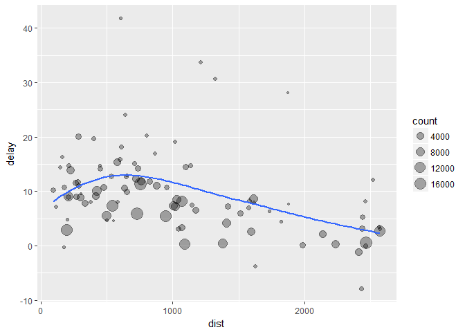

# Exercise


```r
library(tidyverse)
```

```
## Warning: package 'tidyverse' was built under R version 3.3.3
```

```
## Loading tidyverse: ggplot2
## Loading tidyverse: tibble
## Loading tidyverse: tidyr
## Loading tidyverse: readr
## Loading tidyverse: purrr
## Loading tidyverse: dplyr
```

```
## Warning: package 'ggplot2' was built under R version 3.3.3
```

```
## Warning: package 'tibble' was built under R version 3.3.3
```

```
## Warning: package 'tidyr' was built under R version 3.3.3
```

```
## Warning: package 'readr' was built under R version 3.3.3
```

```
## Warning: package 'purrr' was built under R version 3.3.3
```

```
## Warning: package 'dplyr' was built under R version 3.3.3
```

```
## Conflicts with tidy packages ----------------------------------------------
```

```
## filter(): dplyr, stats
## lag():    dplyr, stats
```

```r
library(nycflights13)
```

```
## Warning: package 'nycflights13' was built under R version 3.3.3
```

```r
summarise(flights, delay = mean(dep_delay, na.rm = TRUE))
```

```
## # A tibble: 1 ¡Á 1
##      delay
##      <dbl>
## 1 12.63907
```

```r
by_day <- group_by(flights, year, month, day)
summarise(by_day, delay = mean(dep_delay, na.rm = TRUE))
```

```
## Source: local data frame [365 x 4]
## Groups: year, month [?]
## 
##     year month   day     delay
##    <int> <int> <int>     <dbl>
## 1   2013     1     1 11.548926
## 2   2013     1     2 13.858824
## 3   2013     1     3 10.987832
## 4   2013     1     4  8.951595
## 5   2013     1     5  5.732218
## 6   2013     1     6  7.148014
## 7   2013     1     7  5.417204
## 8   2013     1     8  2.553073
## 9   2013     1     9  2.276477
## 10  2013     1    10  2.844995
## # ... with 355 more rows
```

```r
by_dest <- group_by(flights, dest)
delay <- summarise(by_dest,
  count = n(),
  dist = mean(distance, na.rm = TRUE),
  delay = mean(arr_delay, na.rm = TRUE)
)
delay <- filter(delay, count > 20, dest != "HNL")

ggplot(data = delay, mapping = aes(x = dist, y = delay)) +
  geom_point(aes(size = count), alpha = 1/3) +
  geom_smooth(se = FALSE)
```

```
## `geom_smooth()` using method = 'loess'
```

<!-- -->

```r
delays <- flights %>% 
  group_by(dest) %>% 
  summarise(
    count = n(),
    dist = mean(distance, na.rm = TRUE),
    delay = mean(arr_delay, na.rm = TRUE)
  ) %>% 
  filter(count > 20, dest != "HNL")

flights %>% 
  group_by(year, month, day) %>% 
  summarise(mean = mean(dep_delay))
```

```
## Source: local data frame [365 x 4]
## Groups: year, month [?]
## 
##     year month   day  mean
##    <int> <int> <int> <dbl>
## 1   2013     1     1    NA
## 2   2013     1     2    NA
## 3   2013     1     3    NA
## 4   2013     1     4    NA
## 5   2013     1     5    NA
## 6   2013     1     6    NA
## 7   2013     1     7    NA
## 8   2013     1     8    NA
## 9   2013     1     9    NA
## 10  2013     1    10    NA
## # ... with 355 more rows
```

```r
#get rid of the missing values
flights %>% 
  group_by(year, month, day) %>% 
  summarise(mean = mean(dep_delay, na.rm = TRUE))
```

```
## Source: local data frame [365 x 4]
## Groups: year, month [?]
## 
##     year month   day      mean
##    <int> <int> <int>     <dbl>
## 1   2013     1     1 11.548926
## 2   2013     1     2 13.858824
## 3   2013     1     3 10.987832
## 4   2013     1     4  8.951595
## 5   2013     1     5  5.732218
## 6   2013     1     6  7.148014
## 7   2013     1     7  5.417204
## 8   2013     1     8  2.553073
## 9   2013     1     9  2.276477
## 10  2013     1    10  2.844995
## # ... with 355 more rows
```

```r
not_cancelled <- flights %>% 
  filter(!is.na(dep_delay), !is.na(arr_delay))

not_cancelled %>% 
  group_by(year, month, day) %>% 
  summarise(mean = mean(dep_delay))
```

```
## Source: local data frame [365 x 4]
## Groups: year, month [?]
## 
##     year month   day      mean
##    <int> <int> <int>     <dbl>
## 1   2013     1     1 11.435620
## 2   2013     1     2 13.677802
## 3   2013     1     3 10.907778
## 4   2013     1     4  8.965859
## 5   2013     1     5  5.732218
## 6   2013     1     6  7.145959
## 7   2013     1     7  5.417204
## 8   2013     1     8  2.558296
## 9   2013     1     9  2.301232
## 10  2013     1    10  2.844995
## # ... with 355 more rows
```

```r
delays <- not_cancelled %>% 
  group_by(tailnum) %>% 
  summarise(
    delay = mean(arr_delay)
  )

ggplot(data = delays, mapping = aes(x = delay)) + 
  geom_freqpoly(binwidth = 10)
```

<!-- -->

```r
not_cancelled %>% 
  group_by(year, month, day) %>% 
  summarise(
    avg_delay1 = mean(arr_delay),
    avg_delay2 = mean(arr_delay[arr_delay > 0]) # the average positive delay
  )
```

```
## Source: local data frame [365 x 5]
## Groups: year, month [?]
## 
##     year month   day avg_delay1 avg_delay2
##    <int> <int> <int>      <dbl>      <dbl>
## 1   2013     1     1 12.6510229   32.48156
## 2   2013     1     2 12.6928879   32.02991
## 3   2013     1     3  5.7333333   27.66087
## 4   2013     1     4 -1.9328194   28.30976
## 5   2013     1     5 -1.5258020   22.55882
## 6   2013     1     6  4.2364294   24.37270
## 7   2013     1     7 -4.9473118   27.76132
## 8   2013     1     8 -3.2275785   20.78909
## 9   2013     1     9 -0.2642777   25.63415
## 10  2013     1    10 -5.8988159   27.34545
## # ... with 355 more rows
```

```r
not_cancelled %>% 
  group_by(dest) %>% 
  summarise(distance_sd = sd(distance)) %>% 
  arrange(desc(distance_sd))
```

```
## # A tibble: 104 ¡Á 2
##     dest distance_sd
##    <chr>       <dbl>
## 1    EGE   10.542765
## 2    SAN   10.350094
## 3    SFO   10.216017
## 4    HNL   10.004197
## 5    SEA    9.977993
## 6    LAS    9.907786
## 7    PDX    9.873299
## 8    PHX    9.862546
## 9    LAX    9.657195
## 10   IND    9.458066
## # ... with 94 more rows
```

```r
not_cancelled %>% 
  group_by(year, month, day) %>% 
  summarise(
    first = min(dep_time),
    last = max(dep_time)
  )
```

```
## Source: local data frame [365 x 5]
## Groups: year, month [?]
## 
##     year month   day first  last
##    <int> <int> <int> <int> <int>
## 1   2013     1     1   517  2356
## 2   2013     1     2    42  2354
## 3   2013     1     3    32  2349
## 4   2013     1     4    25  2358
## 5   2013     1     5    14  2357
## 6   2013     1     6    16  2355
## 7   2013     1     7    49  2359
## 8   2013     1     8   454  2351
## 9   2013     1     9     2  2252
## 10  2013     1    10     3  2320
## # ... with 355 more rows
```

```r
not_cancelled %>% 
  group_by(year, month, day) %>% 
  summarise(
    first_dep = first(dep_time), 
    last_dep = last(dep_time)
  )
```

```
## Source: local data frame [365 x 5]
## Groups: year, month [?]
## 
##     year month   day first_dep last_dep
##    <int> <int> <int>     <int>    <int>
## 1   2013     1     1       517     2356
## 2   2013     1     2        42     2354
## 3   2013     1     3        32     2349
## 4   2013     1     4        25     2358
## 5   2013     1     5        14     2357
## 6   2013     1     6        16     2355
## 7   2013     1     7        49     2359
## 8   2013     1     8       454     2351
## 9   2013     1     9         2     2252
## 10  2013     1    10         3     2320
## # ... with 355 more rows
```

```r
not_cancelled %>% 
  group_by(year, month, day) %>% 
  mutate(r = min_rank(desc(dep_time))) %>% 
  filter(r %in% range(r))
```

```
## Source: local data frame [770 x 20]
## Groups: year, month, day [365]
## 
##     year month   day dep_time sched_dep_time dep_delay arr_time
##    <int> <int> <int>    <int>          <int>     <dbl>    <int>
## 1   2013     1     1      517            515         2      830
## 2   2013     1     1     2356           2359        -3      425
## 3   2013     1     2       42           2359        43      518
## 4   2013     1     2     2354           2359        -5      413
## 5   2013     1     3       32           2359        33      504
## 6   2013     1     3     2349           2359       -10      434
## 7   2013     1     4       25           2359        26      505
## 8   2013     1     4     2358           2359        -1      429
## 9   2013     1     4     2358           2359        -1      436
## 10  2013     1     5       14           2359        15      503
## # ... with 760 more rows, and 13 more variables: sched_arr_time <int>,
## #   arr_delay <dbl>, carrier <chr>, flight <int>, tailnum <chr>,
## #   origin <chr>, dest <chr>, air_time <dbl>, distance <dbl>, hour <dbl>,
## #   minute <dbl>, time_hour <dttm>, r <int>
```

```r
not_cancelled %>% 
  group_by(dest) %>% 
  summarise(carriers = n_distinct(carrier)) %>% 
  arrange(desc(carriers))
```

```
## # A tibble: 104 ¡Á 2
##     dest carriers
##    <chr>    <int>
## 1    ATL        7
## 2    BOS        7
## 3    CLT        7
## 4    ORD        7
## 5    TPA        7
## 6    AUS        6
## 7    DCA        6
## 8    DTW        6
## 9    IAD        6
## 10   MSP        6
## # ... with 94 more rows
```

```r
not_cancelled %>% 
  count(dest)
```

```
## # A tibble: 104 ¡Á 2
##     dest     n
##    <chr> <int>
## 1    ABQ   254
## 2    ACK   264
## 3    ALB   418
## 4    ANC     8
## 5    ATL 16837
## 6    AUS  2411
## 7    AVL   261
## 8    BDL   412
## 9    BGR   358
## 10   BHM   269
## # ... with 94 more rows
```

```r
not_cancelled %>% 
  count(tailnum, wt = distance)
```

```
## # A tibble: 4,037 ¡Á 2
##    tailnum      n
##      <chr>  <dbl>
## 1   D942DN   3418
## 2   N0EGMQ 239143
## 3   N10156 109664
## 4   N102UW  25722
## 5   N103US  24619
## 6   N104UW  24616
## 7   N10575 139903
## 8   N105UW  23618
## 9   N107US  21677
## 10  N108UW  32070
## # ... with 4,027 more rows
```

```r
not_cancelled %>% 
  group_by(year, month, day) %>% 
  summarise(n_early = sum(dep_time < 500))
```

```
## Source: local data frame [365 x 4]
## Groups: year, month [?]
## 
##     year month   day n_early
##    <int> <int> <int>   <int>
## 1   2013     1     1       0
## 2   2013     1     2       3
## 3   2013     1     3       4
## 4   2013     1     4       3
## 5   2013     1     5       3
## 6   2013     1     6       2
## 7   2013     1     7       2
## 8   2013     1     8       1
## 9   2013     1     9       3
## 10  2013     1    10       3
## # ... with 355 more rows
```

```r
daily <- group_by(flights, year, month, day)

(per_day   <- summarise(daily, flights = n()))
```

```
## Source: local data frame [365 x 4]
## Groups: year, month [?]
## 
##     year month   day flights
##    <int> <int> <int>   <int>
## 1   2013     1     1     842
## 2   2013     1     2     943
## 3   2013     1     3     914
## 4   2013     1     4     915
## 5   2013     1     5     720
## 6   2013     1     6     832
## 7   2013     1     7     933
## 8   2013     1     8     899
## 9   2013     1     9     902
## 10  2013     1    10     932
## # ... with 355 more rows
```

```r
(per_month <- summarise(per_day, flights = sum(flights)))
```

```
## Source: local data frame [12 x 3]
## Groups: year [?]
## 
##     year month flights
##    <int> <int>   <int>
## 1   2013     1   27004
## 2   2013     2   24951
## 3   2013     3   28834
## 4   2013     4   28330
## 5   2013     5   28796
## 6   2013     6   28243
## 7   2013     7   29425
## 8   2013     8   29327
## 9   2013     9   27574
## 10  2013    10   28889
## 11  2013    11   27268
## 12  2013    12   28135
```

```r
(per_year  <- summarise(per_month, flights = sum(flights)))
```

```
## # A tibble: 1 ¡Á 2
##    year flights
##   <int>   <int>
## 1  2013  336776
```

```r
daily %>% 
  ungroup() %>%             # no longer grouped by date
  summarise(flights = n())  # all flights  
```

```
## # A tibble: 1 ¡Á 1
##   flights
##     <int>
## 1  336776
```

```r
#Exercise 5.6.7
#1-1
not_cancelled <- flights %>% 
  filter(!is.na(dep_delay), !is.na(arr_delay))

not_cancelled %>%
  group_by(flight) %>%
  summarize(early_15_min = mean(arr_delay <= -15), late_15_min = mean(arr_delay >= 15)) %>%
  filter(early_15_min == 0.5, late_15_min == 0.5)
```

```
## # A tibble: 21 ¡Á 3
##    flight early_15_min late_15_min
##     <int>        <dbl>       <dbl>
## 1     107          0.5         0.5
## 2    2072          0.5         0.5
## 3    2366          0.5         0.5
## 4    2500          0.5         0.5
## 5    2552          0.5         0.5
## 6    3495          0.5         0.5
## 7    3505          0.5         0.5
## 8    3518          0.5         0.5
## 9    3544          0.5         0.5
## 10   3651          0.5         0.5
## # ... with 11 more rows
```

```r
#1-2
not_cancelled %>%
  group_by(flight) %>%
  summarize(late_10_min = mean(arr_delay == 10)) %>% 
  filter(late_10_min == 1)
```

```
## # A tibble: 5 ¡Á 2
##   flight late_10_min
##    <int>       <dbl>
## 1   2254           1
## 2   3656           1
## 3   3785           1
## 4   3880           1
## 5   5854           1
```

```r
#1-3
not_cancelled %>%
  group_by(flight) %>%
  summarize(early_30_min = mean(arr_delay <= -30), late_30_min = mean(arr_delay >= 30)) %>%
  filter(early_30_min == 0.5, late_30_min == 0.5)
```

```
## # A tibble: 3 ¡Á 3
##   flight early_30_min late_30_min
##    <int>        <dbl>       <dbl>
## 1   3651          0.5         0.5
## 2   3916          0.5         0.5
## 3   3951          0.5         0.5
```

```r
#1-4
not_cancelled %>%
  group_by(flight) %>%
  summarize(on_time = mean(arr_delay == 0), late_2_hr = mean(arr_delay >= 120)) %>%
  filter(on_time == 0.99, late_2_hr == 0.01)
```

```
## # A tibble: 0 ¡Á 3
## # ... with 3 variables: flight <int>, on_time <dbl>, late_2_hr <dbl>
```

```r
#2
not_cancelled <- flights %>% 
  filter(!is.na(dep_delay), !is.na(arr_delay))

#by using count(dest)
not_cancelled %>%
  count(dest)
```

```
## # A tibble: 104 ¡Á 2
##     dest     n
##    <chr> <int>
## 1    ABQ   254
## 2    ACK   264
## 3    ALB   418
## 4    ANC     8
## 5    ATL 16837
## 6    AUS  2411
## 7    AVL   261
## 8    BDL   412
## 9    BGR   358
## 10   BHM   269
## # ... with 94 more rows
```

```r
#modified
not_cancelled %>%
  group_by(dest) %>%
  summarize(n = n())
```

```
## # A tibble: 104 ¡Á 2
##     dest     n
##    <chr> <int>
## 1    ABQ   254
## 2    ACK   264
## 3    ALB   418
## 4    ANC     8
## 5    ATL 16837
## 6    AUS  2411
## 7    AVL   261
## 8    BDL   412
## 9    BGR   358
## 10   BHM   269
## # ... with 94 more rows
```

```r
#by using count(tailnum, wt = distance)
not_cancelled %>%
  count(tailnum, wt = distance)
```

```
## # A tibble: 4,037 ¡Á 2
##    tailnum      n
##      <chr>  <dbl>
## 1   D942DN   3418
## 2   N0EGMQ 239143
## 3   N10156 109664
## 4   N102UW  25722
## 5   N103US  24619
## 6   N104UW  24616
## 7   N10575 139903
## 8   N105UW  23618
## 9   N107US  21677
## 10  N108UW  32070
## # ... with 4,027 more rows
```

```r
#modified
not_cancelled %>%
  group_by(tailnum) %>%
  summarize(n = sum(distance))
```

```
## # A tibble: 4,037 ¡Á 2
##    tailnum      n
##      <chr>  <dbl>
## 1   D942DN   3418
## 2   N0EGMQ 239143
## 3   N10156 109664
## 4   N102UW  25722
## 5   N103US  24619
## 6   N104UW  24616
## 7   N10575 139903
## 8   N105UW  23618
## 9   N107US  21677
## 10  N108UW  32070
## # ... with 4,027 more rows
```

```r
#3
#dep_delay is the most important column, in case of accident, there will be some flights that do not arrive.

#4

flights %>%
  group_by(year, month, day) %>%
  summarize(prop_canceled = mean(is.na(dep_delay)) ,
            avg_delay = mean(dep_delay, na.rm = TRUE))
```

```
## Source: local data frame [365 x 5]
## Groups: year, month [?]
## 
##     year month   day prop_canceled avg_delay
##    <int> <int> <int>         <dbl>     <dbl>
## 1   2013     1     1   0.004750594 11.548926
## 2   2013     1     2   0.008483563 13.858824
## 3   2013     1     3   0.010940919 10.987832
## 4   2013     1     4   0.006557377  8.951595
## 5   2013     1     5   0.004166667  5.732218
## 6   2013     1     6   0.001201923  7.148014
## 7   2013     1     7   0.003215434  5.417204
## 8   2013     1     8   0.004449388  2.553073
## 9   2013     1     9   0.005543237  2.276477
## 10  2013     1    10   0.003218884  2.844995
## # ... with 355 more rows
```

```r
#5
flights %>%
  group_by(carrier) %>%
  summarize(mean_delay = mean(arr_delay, na.rm = TRUE)) %>%
  arrange(desc(mean_delay))
```

```
## # A tibble: 16 ¡Á 2
##    carrier mean_delay
##      <chr>      <dbl>
## 1       F9 21.9207048
## 2       FL 20.1159055
## 3       EV 15.7964311
## 4       YV 15.5569853
## 5       OO 11.9310345
## 6       MQ 10.7747334
## 7       WN  9.6491199
## 8       B6  9.4579733
## 9       9E  7.3796692
## 10      UA  3.5580111
## 11      US  2.1295951
## 12      VX  1.7644644
## 13      DL  1.6443409
## 14      AA  0.3642909
## 15      HA -6.9152047
## 16      AS -9.9308886
```

```r
#F9 is the worst

flights %>%
  group_by(carrier, dest) %>%
  summarize(mean_delay = mean(arr_delay, na.rm = TRUE)) %>%
  group_by(carrier) %>%
  summarize(mean_delay_mad = mad(mean_delay, na.rm = TRUE)) %>%
  arrange(desc(mean_delay_mad))
```

```
## # A tibble: 16 ¡Á 2
##    carrier mean_delay_mad
##      <chr>          <dbl>
## 1       VX      12.390156
## 2       OO      10.519400
## 3       YV       8.974067
## 4       9E       8.197407
## 5       EV       7.094112
## 6       DL       7.002298
## 7       UA       5.043940
## 8       US       5.034137
## 9       B6       4.995649
## 10      WN       4.506001
## 11      AA       3.311529
## 12      MQ       2.879322
## 13      FL       1.551060
## 14      AS       0.000000
## 15      F9       0.000000
## 16      HA       0.000000
```

```r
#still confused

#6
?count()
```

```
## starting httpd help server ...
```

```
##  done
```

```r
#SORT if TRUE will sort output in descending order of n

flights_sml <- select(flights, 
  year:day, 
  ends_with("delay"), 
  distance, 
  air_time
)
mutate(flights_sml,
  gain = arr_delay - dep_delay,
  speed = distance / air_time * 60
)
```

```
## # A tibble: 336,776 ¡Á 9
##     year month   day dep_delay arr_delay distance air_time  gain    speed
##    <int> <int> <int>     <dbl>     <dbl>    <dbl>    <dbl> <dbl>    <dbl>
## 1   2013     1     1         2        11     1400      227     9 370.0441
## 2   2013     1     1         4        20     1416      227    16 374.2731
## 3   2013     1     1         2        33     1089      160    31 408.3750
## 4   2013     1     1        -1       -18     1576      183   -17 516.7213
## 5   2013     1     1        -6       -25      762      116   -19 394.1379
## 6   2013     1     1        -4        12      719      150    16 287.6000
## 7   2013     1     1        -5        19     1065      158    24 404.4304
## 8   2013     1     1        -3       -14      229       53   -11 259.2453
## 9   2013     1     1        -3        -8      944      140    -5 404.5714
## 10  2013     1     1        -2         8      733      138    10 318.6957
## # ... with 336,766 more rows
```

```r
flights_sml %>% 
  group_by(year, month, day) %>%
  filter(rank(desc(arr_delay)) < 10)
```

```
## Source: local data frame [3,306 x 7]
## Groups: year, month, day [365]
## 
##     year month   day dep_delay arr_delay distance air_time
##    <int> <int> <int>     <dbl>     <dbl>    <dbl>    <dbl>
## 1   2013     1     1       853       851      184       41
## 2   2013     1     1       290       338     1134      213
## 3   2013     1     1       260       263      266       46
## 4   2013     1     1       157       174      213       60
## 5   2013     1     1       216       222      708      121
## 6   2013     1     1       255       250      589      115
## 7   2013     1     1       285       246     1085      146
## 8   2013     1     1       192       191      199       44
## 9   2013     1     1       379       456     1092      222
## 10  2013     1     2       224       207      550       94
## # ... with 3,296 more rows
```

```r
popular_dests <- flights %>% 
  group_by(dest) %>% 
  filter(n() > 365)
popular_dests
```

```
## Source: local data frame [332,577 x 19]
## Groups: dest [77]
## 
##     year month   day dep_time sched_dep_time dep_delay arr_time
##    <int> <int> <int>    <int>          <int>     <dbl>    <int>
## 1   2013     1     1      517            515         2      830
## 2   2013     1     1      533            529         4      850
## 3   2013     1     1      542            540         2      923
## 4   2013     1     1      544            545        -1     1004
## 5   2013     1     1      554            600        -6      812
## 6   2013     1     1      554            558        -4      740
## 7   2013     1     1      555            600        -5      913
## 8   2013     1     1      557            600        -3      709
## 9   2013     1     1      557            600        -3      838
## 10  2013     1     1      558            600        -2      753
## # ... with 332,567 more rows, and 12 more variables: sched_arr_time <int>,
## #   arr_delay <dbl>, carrier <chr>, flight <int>, tailnum <chr>,
## #   origin <chr>, dest <chr>, air_time <dbl>, distance <dbl>, hour <dbl>,
## #   minute <dbl>, time_hour <dttm>
```

```r
popular_dests %>% 
  filter(arr_delay > 0) %>% 
  mutate(prop_delay = arr_delay / sum(arr_delay)) %>% 
  select(year:day, dest, arr_delay, prop_delay)
```

```
## Source: local data frame [131,106 x 6]
## Groups: dest [77]
## 
##     year month   day  dest arr_delay   prop_delay
##    <int> <int> <int> <chr>     <dbl>        <dbl>
## 1   2013     1     1   IAH        11 1.106740e-04
## 2   2013     1     1   IAH        20 2.012255e-04
## 3   2013     1     1   MIA        33 2.350026e-04
## 4   2013     1     1   ORD        12 4.239594e-05
## 5   2013     1     1   FLL        19 9.377853e-05
## 6   2013     1     1   ORD         8 2.826396e-05
## 7   2013     1     1   LAX         7 3.444441e-05
## 8   2013     1     1   DFW        31 2.817951e-04
## 9   2013     1     1   ATL        12 3.996017e-05
## 10  2013     1     1   DTW        16 1.157257e-04
## # ... with 131,096 more rows
```

```r
#Excercise 5.7.1

#1
?mutate()
?filter()

#2
flights %>% 
  group_by(tailnum) %>%
  filter(rank(desc(arr_delay)) < 10) %>%
  arrange(desc(arr_delay))
```

```
## Source: local data frame [33,429 x 19]
## Groups: tailnum [4,044]
## 
##     year month   day dep_time sched_dep_time dep_delay arr_time
##    <int> <int> <int>    <int>          <int>     <dbl>    <int>
## 1   2013     1     9      641            900      1301     1242
## 2   2013     6    15     1432           1935      1137     1607
## 3   2013     1    10     1121           1635      1126     1239
## 4   2013     9    20     1139           1845      1014     1457
## 5   2013     7    22      845           1600      1005     1044
## 6   2013     4    10     1100           1900       960     1342
## 7   2013     3    17     2321            810       911      135
## 8   2013     7    22     2257            759       898      121
## 9   2013    12     5      756           1700       896     1058
## 10  2013     5     3     1133           2055       878     1250
## # ... with 33,419 more rows, and 12 more variables: sched_arr_time <int>,
## #   arr_delay <dbl>, carrier <chr>, flight <int>, tailnum <chr>,
## #   origin <chr>, dest <chr>, air_time <dbl>, distance <dbl>, hour <dbl>,
## #   minute <dbl>, time_hour <dttm>
```

```r
#N384HA is the worst
```


